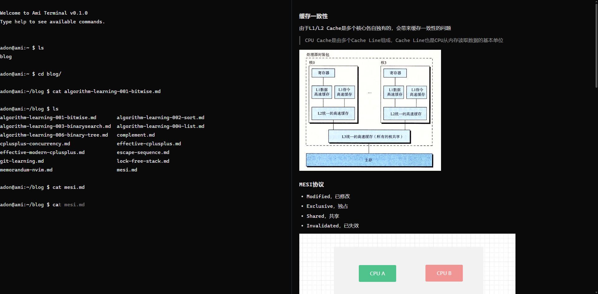

# Ami Terminal

A personal terminal-style website. Type commands, browse files, read blog posts — just like a real Linux terminal.



## Quick Start

```bash
npm install
npm run dev        # http://localhost:5173
npm run build      # production build → dist/
npm run preview    # preview production build
npm test           # run tests
```

## Commands

| Command | Description |
|---------|-------------|
| `ls` | List directory (`-l` detail, `-a` all) |
| `cd <dir>` | Change directory (`..` / `~` / `-`) |
| `cat <file>` | Preview files (`.md` → rich Markdown, images → preview, text → plain) |
| `grep <pattern> <file>` | Search text (`-i` case, `-n` line numbers, `-r` recursive, `-t` tag) |
| `echo <text>` | Print text (`-n` no newline) |
| `pwd` | Print working directory |
| `whoami` | Show profile panel |
| `help` | List all commands |
| `history` | Command history |
| `clear` / `Ctrl+L` | Clear screen |
| `theme` | Switch color theme |

## Features

- **Full terminal emulation** via xterm.js 6
- **Tab completion** with cycling (Tab / Shift+Tab)
- **Fish-style autosuggestions** from command history (→ to accept)
- **Inline cursor movement** (← → arrows, mid-line editing)
- **Rich Markdown** with GFM tables & LaTeX math ($E=mc^2$)
- **Image preview** for JPG/PNG/GIF
- **Virtual filesystem** — drop `.md` files in `src/fs/content/`, auto-discovered
- **Configurable profile** in `src/config.ts`

## Project Structure

```
src/
├── terminal/       # xterm.js wrapper
├── commands/       # command implementations
├── fs/             # virtual filesystem
├── output/         # MarkdownView, CSS
├── themes/         # color schemes
├── utils/          # column layout
├── hooks/          # useSyncedRef
├── components/     # ErrorBoundary
└── config.ts       # profile info, avatar URL
```

## Tech Stack

- React 19 + TypeScript 7
- xterm.js 6
- react-markdown + KaTeX
- Vite 8
- Vitest

## License

MIT
